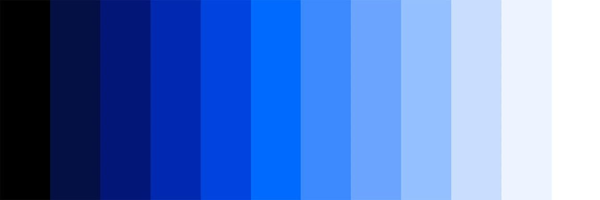

import HomepageTemplate from 'gatsby-theme-carbon/src/templates/Homepage';
export default HomepageTemplate;

## MDX content starts here

<PageDescription>

This extension includes tools for developing for Rock RMS in the lightweight, extensible VSCode editor. The included tools provide features for syntax highlighting and snippets Lava.

</PageDescription>

<FeatureCard
    color="dark"
    href="/getting-started"
    title="Getting started"
    actionIcon="arrowRight"
    className="homepage-feature"
    >

<ArtDirection>

</ArtDirection>

</FeatureCard>
